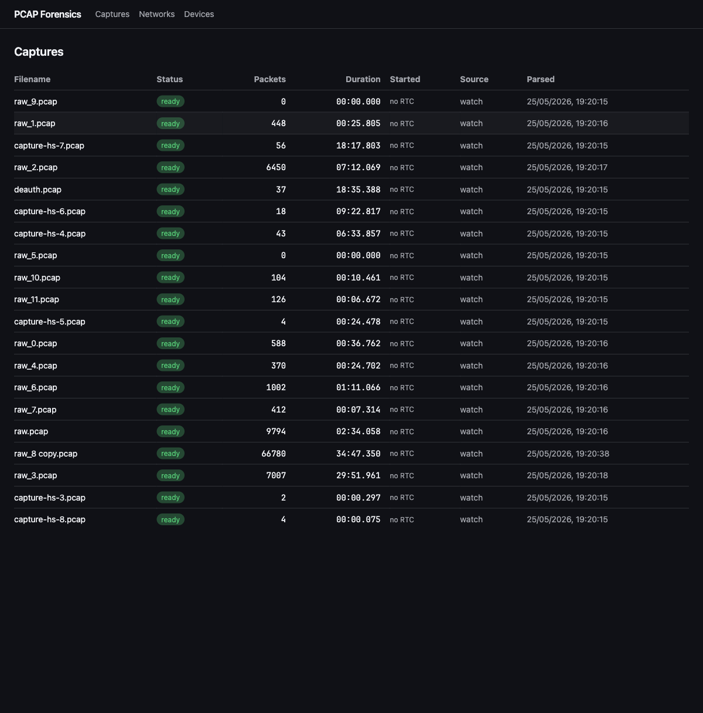
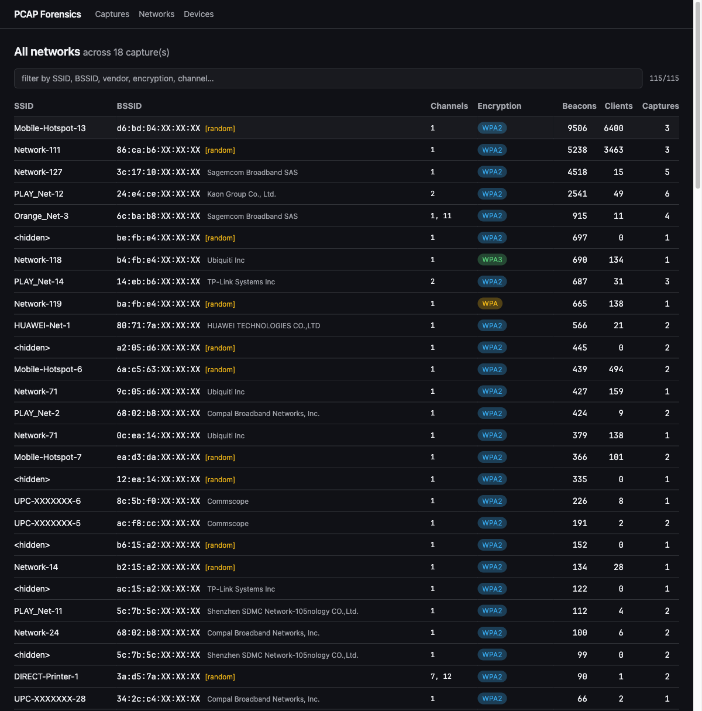
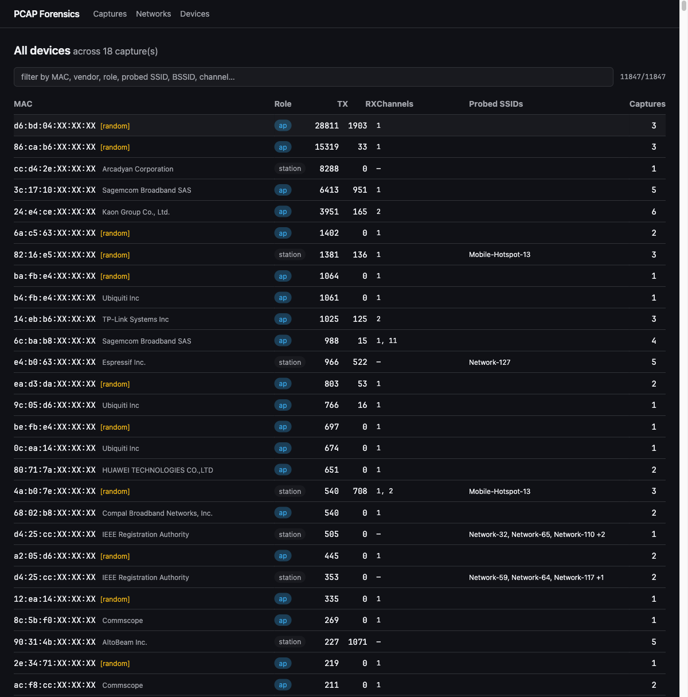
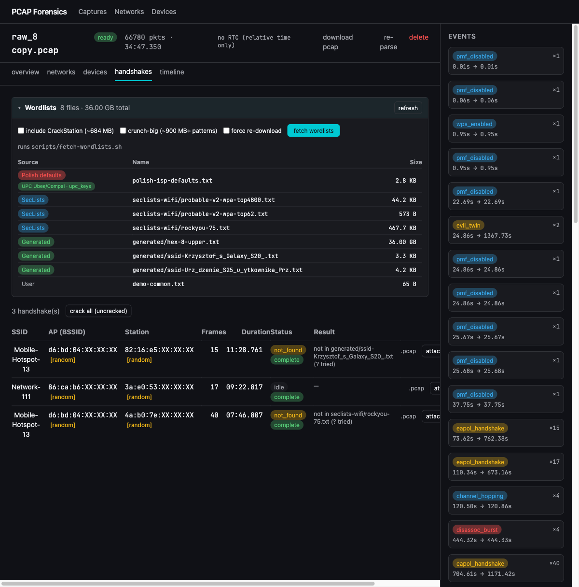

# pcap-parser

Local-first 802.11 pcap forensic dashboard. Built for analyzing captures from
the Bruce firmware (M5Stack/ESP32 WiFi sniffer).

## Screenshots

| | |
|---|---|
|  |  |
| Captures list — drag-drop or watcher-ingested pcaps | Global Networks view — aggregated across all captures |
|  |  |
| Global Devices view — vendors, roles, probed SSIDs | Handshakes tab with Wordlists panel, "attack via SSID" one-click action, and keygen hints |

SSIDs, BSSIDs and capture filenames are masked in these screenshots — real
identifying data is replaced with `Network-N`, `XX:XX:XX` last-3-octets, and
`capture-hs-N.pcap` placeholders.

## Requirements

- [Bun](https://bun.sh) 1.3+
- [Wireshark / tshark](https://www.wireshark.org/) 4.x — `brew install wireshark` on macOS

## Run

```bash
bun install
bun run dev
# open http://localhost:5173
```

On first run, the sample pcaps from the repo (`raw.pcap`, `deauth.pcap`) are
seeded into `captures/` and ingested automatically.

## Add captures

- Drag-and-drop a `.pcap` onto the browser window, **or**
- Drop a `.pcap` into `./captures/` — the chokidar watcher auto-ingests it.

## What it shows

- **Networks**: SSID, BSSID + vendor, channel, encryption (WPA/WPA2/WPA3
  derived from RSN AKM types), beacon and client counts.
- **Devices**: MAC + vendor, role (AP/STA), TX/RX packet counts, channels
  observed, probed SSIDs, associated BSSIDs. Random/locally-administered
  MACs flagged as `[random]`.
- **Events**: deauth bursts (≥3 within 60s), EAPOL 4-way handshakes,
  probe-floods (karma, ≥20 SSIDs from one STA), hidden-SSID reveals,
  channel hopping (STA seen on ≥3 channels).
- **Timeline**: paged per-packet view; click an event in the sidebar to
  scope the timeline to that event's actors and time range.

## Docker

```bash
docker build -t pcap-parser .
docker run --rm -p 3000:3000 \
  -v $PWD/captures:/app/captures \
  -v $PWD/data:/app/data \
  pcap-parser
```

## Wordlists (handshake cracking)

`wordlists/` is gitignored — populate it with the fetch script:

```bash
bun run wordlists:fetch                  # SecLists subset + CrackStation + Polish ISP defaults + small crunch lists
bun run wordlists:fetch -- --skip-crackstation     # skip the ~684 MB extract
bun run wordlists:fetch -- --crunch-big            # also generate 8-digit (~900 MB)
bun run wordlists:fetch -- --force                 # redownload / regenerate
```

What it fetches:

- **SecLists subset** (`seclists-wifi/`) — `probable-v2-wpa-top62/top4800`,
  `darkweb2017-top10000`, `10-million-top-10000/100000`, `rockyou-75`.
- **CrackStation** (`crackstation/crackstation-human-only.txt`) — 684 MB of
  real-world human passwords. ~247 MB compressed download.
- **crunch-generated** (`generated/`) — needs `crunch` (`brew install crunch`
  / `apt install crunch`). Default run produces `hex-8-upper` and
  `pl-mobile-9digit`. `--crunch-big` adds `digits-8` and `hex-10-lower`.
- **Polish ISP defaults** (`polish-isp-defaults.txt`) — curated common weak
  PSKs for Funbox / Livebox / PLAY / UPC / T-Mobile / Netia / Vectra etc.
  Sticker keys are random; this targets the human-changed + factory-weak tail.
  For serial-derived keygen attacks (UPC, older Liveboxes, Thomson) use
  dedicated tools (`upc_keys`, `mkr-router-keygen`).

### Custom crunch recipes

```bash
bun run wordlists:crunch list                   # list recipes
bun run wordlists:crunch digits-8               # 8-digit numeric (~900 MB)
bun run wordlists:crunch pl-mobile              # PL mobile-number pattern
bun run wordlists:crunch hex-8-upper            # 8-char upper hex
bun run wordlists:crunch ssid-suffix MyNetwork  # SSID + 00..99, years, common suffixes
```

Files dropped into `wordlists/` (or any subdir — listing is non-recursive) are
picked up by the UI's handshake-cracking dropdown and passed to `aircrack-ng -w`.

## Tests

```bash
bun test
```

26 tests cover the full pipeline against real Bruce sample pcaps:
format helpers, OUI lookup, tshark streaming, packet normalization,
aggregate (networks + devices + encryption derivation), and each detector.

**Test fixtures are not committed** (pcaps are gitignored). To run the tests
locally, place these two files in `tests/fixtures/`:

- `raw.pcap` — a normal 802.11 sniffer capture (one with networks and
  devices to detect)
- `deauth.pcap` — a capture containing deauth/disassoc frames, used to
  verify the deauth-burst detector

Any Bruce pcap will work for `raw.pcap`. For `deauth.pcap`, run Bruce's
deauth feature and capture the result.

## Notes on Bruce captures

- **No radiotap header** → no RSSI / signal info; channel is derived from
  beacon `DS Parameter Set` IE only. The UI hides signal columns when
  `has_radiotap = 0`.
- **No RTC** → frame timestamps are relative seconds from capture start.
  Times display as `mm:ss.fff` and `+Ns since capture start`. No fake
  absolute dates.

## Architecture

```
Browser  ──HTTP──▶  SvelteKit (Bun)
                      ├─ /api/captures      POST upload, GET list
                      ├─ /api/captures/:id  GET detail, DELETE
                      ├─ /api/captures/:id/packets   paginated/filtered
                      ├─ /api/captures/:id/reparse   POST
                      └─ ingestor: spawns tshark, streams NDJSON into SQLite
                                ↑
                       captures/ folder watcher (chokidar) auto-ingests
```

One process. SQLite (`bun:sqlite`) is the only state. `tshark -T ek` runs
as a subprocess via `Bun.spawn` (argv-only, no shell — user-supplied
filenames cannot escape into a command line).
